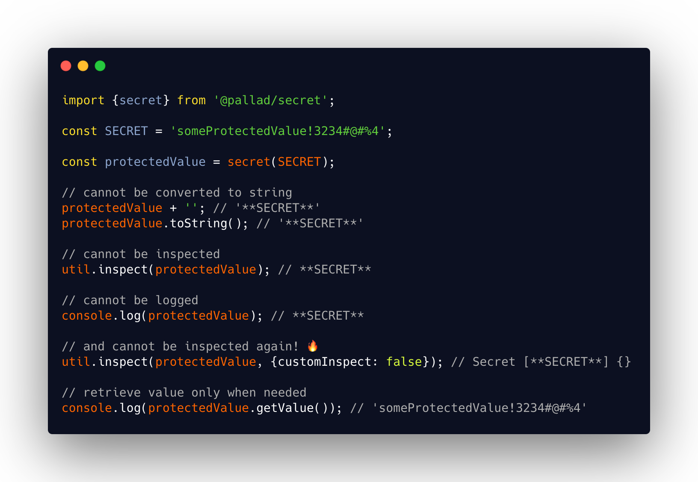

<div align="center">
<h1>Secret 🤫</h1>

<p>Prevent your secrets from accidental leak</p>
</div>

---
[](https://circleci.com/gh/pallad-ts/secret/tree/master)
[](https://badge.fury.io/js/@pallad%2Fsecret)
[](https://coveralls.io/github/pallad-ts/secret?branch=master)
[](https://opensource.org/licenses/MIT)
---



Wraps any value and prevents it to:

* be converted to string
* serialized (for example by `JSON.stringify`)
* inspected (through `util.inspect`)
* logged (through `console.log`) or debugged.

# Use cases

* Passing around un/encrypted password
* Storing confidential credentials (api keys, database passwords)
* Wrapping config values

# Features

* 👷 Built with Typescript - full type friendly
* ✅

# Community

Join our [discord server](https://discord.gg/paTBKBxXnA)

# Installation

```shell
npm install @pallad/secret
```

# Usage

Just wrap it with `secret` or `new Secret`. It order to retrieve value you need to explicity call `getValue` method

```typescript
import {Secret, secret} from '@pallad/secret';

const SECRET = 'someProtectedValue!3234#@#%4';

const protectedValue = new Secret(SECRET);
// or 
const protectedValue2 = secret(SECRET);

protectedValue + ''; // '**SECRET**'
protectedValue.toString(); // '**SECRET**'
util.inspect(protectedValue); // **SECRET**
console.log(protectedValue); // **SECRET**
util.inspect(protectedValue, {customInspect: false}); // Secret [**SECRET**] {}
```

## Custom description

Instead of `'**SECRET**'` you can print something else.

```typescript
import {Secret} from '@pallad/secret';

const protectedValue = new Secret(SECRET, 'CustomDescription');

String(protectedValue); // 'CustomDescription'

console.log(protectedValue); // CustomDescription
util.inspect(protectedValue, {customInspect: false}); // CustomDescription
```

## Wrapping function result

`protect` wraps a function with another function that wraps returned value with secret for you.

```typescript
import {protect, Secret} from '@pallad/secret';

const result1 = protect(x => 'protectedValue')();
Secret.is(result1); // true
result1.getValue(); // 'protectedValue')
```

Promises are also handled (full type support)

```typescript
const result2 = protect(x => Promise.resolve('protectedValue'))();

result2.then(x => {
  Secret.is(x); // true
  x.getValue(); // 'protectedValue'
})
```

